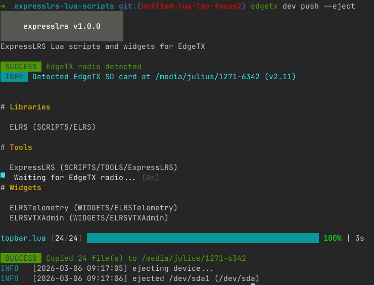

# EdgeTX CLI

A development and management tool for EdgeTX Lua scripts and radios.



## Features

- **Live sync** — watch source files and continuously sync changes to an EdgeTX simulator SD card directory
- **Push to radio** — auto-detect connected radios, deploy packages with a progress bar, and optionally eject when done
- **Package manifests** — `edgetx.toml` defines your scripts, dependencies, file layout, and exclusions
- **Scaffold scripts** — generate boilerplate for tools, widgets, telemetry, functions, mixes, and libraries
- **Backup** — full SD card backup with optional zip compression and auto-eject
- **Cross-platform** — Linux, macOS, and Windows with platform-specific radio detection

## Installation

With Go installed:

```sh
go install github.com/jurgelenas/edgetx-cli@latest
```

### Build from source

```sh
git clone https://github.com/jurgelenas/edgetx-cli.git
cd edgetx-cli
make build
```

The binary is written to `bin/edgetx-cli`.

## Quick Start

### 1. Initialize a manifest

```sh
edgetx-cli dev init my-scripts
```

This creates an `edgetx.toml` in the current directory.

### 2. Scaffold a script

```sh
edgetx-cli dev scaffold tool MyTool
edgetx-cli dev scaffold widget MyWidget --depends "MyLib"
```

Supported types: `tool`, `widget`, `telemetry`, `function`, `mix`, `library`.

### 3. Sync to the simulator

Point `dev sync` at your EdgeTX simulator's SD card directory. It performs an initial copy then watches for changes:

```sh
edgetx-cli dev sync /path/to/simulator-sdcard
```

Edit your Lua files — changes appear in the simulator immediately.

### 4. Push to a radio

Connect your radio in USB storage mode, then push your package to it:

```sh
edgetx-cli dev push --eject
```

The CLI auto-detects the radio, copies all files, and safely ejects.

## Commands

### `dev sync <target-dir>`

Watch source files and sync changes to a target directory.

```sh
edgetx-cli dev sync /path/to/edgetx-sdcard
edgetx-cli dev sync --src-dir ./my-project /path/to/edgetx-sdcard
```

| Flag        | Default | Description                               |
|-------------|---------|-------------------------------------------|
| `--src-dir` | `.`     | Source directory containing `edgetx.toml` |

### `dev push`

Push package contents to a connected EdgeTX radio.

```sh
edgetx-cli dev push
edgetx-cli dev push --eject
edgetx-cli dev push --dry-run
```

| Flag        | Default | Description                                          |
|-------------|---------|------------------------------------------------------|
| `--src-dir` | `.`     | Source directory containing `edgetx.toml`            |
| `--eject`   | `false` | Safely unmount and power off the radio after copying |
| `--dry-run` | `false` | Show what would be copied without writing anything   |

### `dev init [name]`

Initialize a new `edgetx.toml` manifest. Uses the directory name if no name is given.

```sh
edgetx-cli dev init my-scripts
```

| Flag        | Default | Description                          |
|-------------|---------|--------------------------------------|
| `--src-dir` | `.`     | Directory to create `edgetx.toml` in |

### `dev scaffold <type> <name>`

Generate boilerplate for a new EdgeTX Lua script and register it in `edgetx.toml`.

```sh
edgetx-cli dev scaffold tool MyTool
edgetx-cli dev scaffold widget MyWidget --depends "SharedLib"
edgetx-cli dev scaffold library SharedLib
```

| Flag        | Default | Description                               |
|-------------|---------|-------------------------------------------|
| `--src-dir` | `.`     | Source directory containing `edgetx.toml` |
| `--depends` |         | Comma-separated library dependencies      |

**Types and output paths:**

| Type        | Path                            | Name limit |
|-------------|---------------------------------|------------|
| `tool`      | `SCRIPTS/TOOLS/<name>/main.lua` | —          |
| `telemetry` | `SCRIPTS/TELEMETRY/<name>.lua`  | 6 chars    |
| `function`  | `SCRIPTS/FUNCTIONS/<name>.lua`  | 6 chars    |
| `mix`       | `SCRIPTS/MIXES/<name>.lua`      | 6 chars    |
| `widget`    | `WIDGETS/<name>/main.lua`       | 8 chars    |
| `library`   | `SCRIPTS/<name>/main.lua`       | —          |

### `backup`

Back up a connected radio's SD card.

```sh
edgetx-cli backup
edgetx-cli backup --compress --eject
edgetx-cli backup --directory ~/backups --name my-radio
```

| Flag          | Default | Description                                         |
|---------------|---------|-----------------------------------------------------|
| `--compress`  | `false` | Create a `.zip` archive instead of a directory      |
| `--directory` | `.`     | Output directory for the backup                     |
| `--name`      |         | Custom backup name prefix (date is always appended) |
| `--eject`     | `false` | Safely unmount radio after backup                   |

Backups are named `backup-YYYY-MM-DD` (or `<name>-YYYY-MM-DD` with `--name`).

### Global flags

| Flag              | Default | Description                          |
|-------------------|---------|--------------------------------------|
| `-v`, `--verbose` | `false` | Enable debug logging                 |
| `--log-format`    | `text`  | Log output format (`text` or `json`) |

## Manifest format

The `edgetx.toml` file describes your package and its contents:

```toml
[package]
name = "expresslrs"
version = "1.0.0"
description = "ExpressLRS Lua scripts and widgets for EdgeTX"
source_dir = "src"  # optional: subdirectory containing source files

[[libraries]]
name = "ELRS"
path = "SCRIPTS/ELRS"

[[tools]]
name = "ExpressLRS"
path = "SCRIPTS/TOOLS/ExpressLRS"
depends = ["ELRS"]

[[widgets]]
name = "ELRSTelemetry"
path = "WIDGETS/ELRSTelemetry"
depends = ["ELRS"]
exclude = ["*.luac"]

[[telemetry]]
name = "MyTelem"
path = "SCRIPTS/TELEMETRY/MyTelem"

[[functions]]
name = "MyFunc"
path = "SCRIPTS/FUNCTIONS/MyFunc"

[[mixes]]
name = "MyMix"
path = "SCRIPTS/MIXES/MyMix"
```

- `depends` references entries in `[[libraries]]`
- `exclude` takes glob patterns to skip during copy (e.g., `["*.luac", "presets.txt"]`)
- `source_dir` is relative to the manifest file; all `path` values are relative to the source root

## Platform support

Radio detection works by scanning mounted volumes for the `edgetx.sdcard.version` marker file:

- **Linux** — scans `/media/<user>`, ejects via `udisksctl`
- **macOS** — scans `/Volumes`
- **Windows** — scans drive letters

## License

[GPL-3.0](LICENSE)
