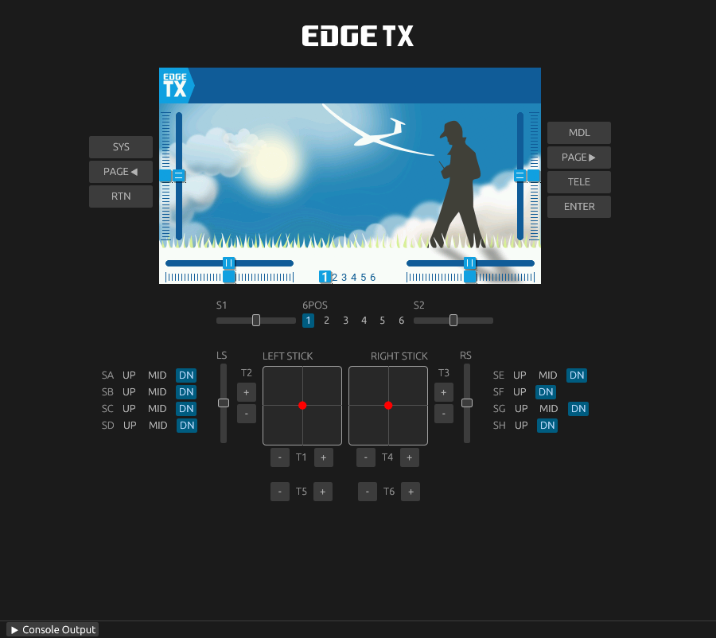

# EdgeTX CLI

A command-line tool for managing Lua script packages on EdgeTX radios - and for developing new ones.


## Features

- **Package management** -install, update, remove, and list third-party Lua script packages from Git repositories
- **Backup** -full SD card backup with optional zip compression and auto-eject
- **Live sync** -watch source files and continuously sync changes to an EdgeTX simulator SD card directory
- **Scaffold scripts** -generate boilerplate for tools, widgets, telemetry, functions, mixes, and libraries
- **Package manifests** -`edgetx.yml` defines your scripts, dependencies, file layout, and exclusions
- **Simulator** -run an EdgeTX simulator locally with live-reload, headless mode, and Lua test scripts
- **Cross-platform** -Linux, macOS, and Windows with platform-specific radio detection

## Installation

### Install with cargo

```sh
cargo install --git https://github.com/jurgelenas/edgetx-cli.git
```

### Build from source

```sh
git clone https://github.com/jurgelenas/edgetx-cli.git
cd edgetx-cli
cargo build --release
```

The binary is written to `target/release/edgetx-cli`.

---

## Managing Your Radio

### Quick Start

1. **Connect your radio** in USB storage mode.
2. **Back up your SD card** before making any changes:
   ```sh
   edgetx-cli backup --compress --eject
   ```
3. **Install a package** from a Git repository:
   ```sh
   edgetx-cli pkg install ExpressLRS/Lua-Scripts@v1.6.0 --eject
   ```
4. **List installed packages:**
   ```sh
   edgetx-cli pkg list
   ```
5. **Update or remove packages:**
   ```sh
   edgetx-cli pkg update --all
   edgetx-cli pkg remove expresslrs
   ```
6. **Eject the radio** when you're done:
   ```sh
   edgetx-cli eject
   ```

### Available packages

These are experimental community packages you can install:

```sh
# ExpressLRS Lua scripts
edgetx-cli pkg install ExpressLRS/Lua-Scripts@unified-lua-lsp

# Betaflight TX Lua scripts
edgetx-cli pkg install jurgelenas/betaflight-tx-lua-scripts@edgetx-package

# Rotorflight Lua scripts
edgetx-cli pkg install jurgelenas/rotorflight-lua-scripts@edgetx-package

# iNav Telemetry Widget
edgetx-cli pkg install jurgelenas/iNav-Telemetry-Widget@edgetx-package

# Yaapu Telemetry Script (color LCD variant)
edgetx-cli pkg install jurgelenas/YaapuTelemetryScript@edgetx-package --path edgetx.c480x272.yml

# Horus Mapping Widget
edgetx-cli pkg install jurgelenas/HorusMappingWidget@edgetx-package

# ELRS Finder (B&W)
edgetx-cli pkg install jurgelenas/edgetx-lua-scripts-bw@edgetx-package --path edgetx.elrs-finder.yml

# Field Notes (B&W)
edgetx-cli pkg install jurgelenas/edgetx-lua-scripts-bw@edgetx-package --path edgetx.fieldnotes.yml

# X10-series scripts - various tools
edgetx-cli pkg install jurgelenas/edgetx-x10-scripts@edgetx-package --path edgetx.log-viewer.yml
edgetx-cli pkg install jurgelenas/edgetx-x10-scripts@edgetx-package --path edgetx.flights-history.yml
edgetx-cli pkg install jurgelenas/edgetx-x10-scripts@edgetx-package --path edgetx.frsky-gyro-suite.yml
edgetx-cli pkg install jurgelenas/edgetx-x10-scripts@edgetx-package --path edgetx.model-locator-rssi.yml
edgetx-cli pkg install jurgelenas/edgetx-x10-scripts@edgetx-package --path edgetx.presets-loader.yml
edgetx-cli pkg install jurgelenas/edgetx-x10-scripts@edgetx-package --path edgetx.cell-mix.yml

# EdgeTX Log Viewer (B&W)
edgetx-cli pkg install https://github.com/jurgelenas/EdgeTXLogViewerBW@edgetx-package

# SpiderFI Battery Widget (color LCD)
edgetx-cli pkg install jurgelenas/EdgeTX-Battery-Widget@edgetx-package

# SpiderFI LQ or dBm Widget (color LCD)
edgetx-cli pkg install jurgelenas/EdgeTX-LQorDBM-Widget@edgetx-package

# SpiderFI TX Battery Widget (color LCD)
edgetx-cli pkg install jurgelenas/EdgeTX-TXBatt-Widget@edgetx-package
```

### `backup`

Back up a connected radio's SD card.

```sh
edgetx-cli backup
edgetx-cli backup --compress --eject
edgetx-cli backup --directory ~/backups --name my-radio
```

| Flag          | Default | Description                                         |
|---------------|---------|-----------------------------------------------------|
| `--compress`  | `false` | Create a `.zip` archive instead of a directory      |
| `--directory` | `.`     | Output directory for the backup                     |
| `--name`      |         | Custom backup name prefix (date is always appended) |
| `--eject`     | `false` | Safely unmount radio after backup                   |

Backups are named `backup-YYYY-MM-DD` (or `<name>-YYYY-MM-DD` with `--name`).

### `eject`

Safely unmount a connected EdgeTX radio.

```sh
edgetx-cli eject
```

No flags — the radio is auto-detected the same way as all other commands.

### `pkg install <package>`

Install a package from a Git repository or local directory.

```sh
edgetx-cli pkg install ExpressLRS/Lua-Scripts
edgetx-cli pkg install ExpressLRS/Lua-Scripts@v1.6.0
edgetx-cli pkg install gitea.example.com/user/repo@main
edgetx-cli pkg install Org/Repo::edgetx.c480x272.yml@branch
edgetx-cli pkg install Org/Repo --path edgetx.c480x272.yml
```

| Flag        | Default | Description                                           |
|-------------|---------|-------------------------------------------------------|
| `--dir`     |         | SD card directory (auto-detect if not set)            |
| `--path`    |         | Manifest file or subdirectory within the repo         |
| `--eject`   | `false` | Safely unmount and power off the radio after install  |
| `--dry-run` | `false` | Show what would be installed without writing anything |
| `--dev`     | `false` | Include development dependencies                      |

**Version resolution:** When no `@version` is specified, the CLI queries the remote repository for all tags and installs the latest [semver](https://semver.org/)-compatible tag (e.g. `v2.1.0`). If no semver tags exist, the default branch HEAD is used.

**Package references:**

- GitHub shorthand: `Org/Repo`, `Org/Repo@v1.0.0`, `Org/Repo@main`, `Org/Repo@abc123`
- Alternate manifest: `Org/Repo::subpath`, `Org/Repo::edgetx.c480x272.yml@v1.0`
- Full URL: `host.com/org/repo`, `https://host.com/org/repo@v1.0`
- Local path: `.`, `./path`, `/absolute/path` (see [Installing and updating local packages](#installing-and-updating-local-packages))

### `pkg update [package]`

Update an installed package to the latest version.

```sh
edgetx-cli pkg update ExpressLRS/Lua-Scripts
edgetx-cli pkg update Org/Repo::edgetx.c480x272.yml
edgetx-cli pkg update Org/Repo --path edgetx.c480x272.yml
edgetx-cli pkg update expresslrs
edgetx-cli pkg update --all
```

| Flag        | Default | Description                                                              |
|-------------|---------|--------------------------------------------------------------------------|
| `--dir`     |         | SD card directory (auto-detect if not set)                               |
| `--path`    |         | Manifest file or subdirectory within the repo                            |
| `--all`     | `false` | Update all installed packages                                            |
| `--eject`   | `false` | Safely unmount radio after update                                        |
| `--dry-run` | `false` | Show what would be updated without writing anything                      |
| `--dev`     | `false` | Include development dependencies (overrides the stored install preference)|

### `pkg remove <package>`

Remove an installed package and all its files.

```sh
edgetx-cli pkg remove ExpressLRS/Lua-Scripts
edgetx-cli pkg remove Org/Repo::edgetx.c480x272.yml
edgetx-cli pkg remove Org/Repo --path edgetx.c480x272.yml
edgetx-cli pkg remove expresslrs
```

| Flag        | Default | Description                                          |
|-------------|---------|------------------------------------------------------|
| `--dir`     |         | SD card directory (auto-detect if not set)           |
| `--path`    |         | Manifest file or subdirectory within the repo        |
| `--eject`   | `false` | Safely unmount radio after removal                   |
| `--dry-run` | `false` | Show what would be removed without deleting anything |

### `pkg list`

List all installed packages.

```sh
edgetx-cli pkg list
edgetx-cli pkg list --dir /tmp/sdcard
```

| Flag    | Default | Description                                |
|---------|---------|--------------------------------------------|
| `--dir` |         | SD card directory (auto-detect if not set) |

---

## Developing Packages

### Quick Start

1. **Initialize a manifest:**
   ```sh
   edgetx-cli dev init my-scripts
   ```
2. **Scaffold a script:**
   ```sh
   edgetx-cli dev scaffold tool MyTool
   ```
3. **Run the simulator:**
   ```sh
   edgetx-cli dev simulator --radio "Radiomaster TX16S"
   ```
4. **Sync to the simulator:**
   ```sh
   edgetx-cli dev sync /path/to/simulator-sdcard
   ```
5. **Install to a radio:**
   ```sh
   edgetx-cli pkg install . --eject
   ```

### `dev init [name]`

Initialize a new `edgetx.yml` manifest. Uses the directory name if no name is given.

```sh
edgetx-cli dev init my-scripts
```

| Flag        | Default | Description                         |
|-------------|---------|-------------------------------------|
| `--src-dir` | `.`     | Directory to create `edgetx.yml` in |

### `dev scaffold <type> <name>`

Generate boilerplate for a new EdgeTX Lua script and register it in `edgetx.yml`.

```sh
edgetx-cli dev scaffold tool MyTool
edgetx-cli dev scaffold widget MyWidget --depends "SharedLib"
edgetx-cli dev scaffold library SharedLib
```

| Flag        | Default | Description                              |
|-------------|---------|------------------------------------------|
| `--src-dir` | `.`     | Source directory containing `edgetx.yml` |
| `--depends` |         | Comma-separated library dependencies     |
| `--dev`     | `false` | Mark as a development dependency         |

**Types and output paths:**

| Type        | Path                            | Name limit |
|-------------|---------------------------------|------------|
| `tool`      | `SCRIPTS/TOOLS/<name>/main.lua` | -         |
| `telemetry` | `SCRIPTS/TELEMETRY/<name>.lua`  | 6 chars    |
| `function`  | `SCRIPTS/FUNCTIONS/<name>.lua`  | 6 chars    |
| `mix`       | `SCRIPTS/MIXES/<name>.lua`      | 6 chars    |
| `widget`    | `WIDGETS/<name>/main.lua`       | 8 chars    |
| `library`   | `SCRIPTS/<name>/main.lua`       | -         |

### `dev sync <target-dir>`

Watch source files and sync changes to a target directory.

```sh
edgetx-cli dev sync /path/to/edgetx-sdcard
edgetx-cli dev sync --src-dir ./my-project /path/to/edgetx-sdcard
```

| Flag        | Default | Description                              |
|-------------|---------|------------------------------------------|
| `--src-dir` | `.`     | Source directory containing `edgetx.yml` |
| `--no-dev`  | `false` | Exclude development dependencies         |

### `dev simulator`

Run the EdgeTX simulator. When run from a directory containing `edgetx.yml`, the package is automatically installed into the simulator's SD card and file changes are live-synced.



```sh
edgetx-cli dev simulator --radio "Radiomaster TX16S"
edgetx-cli dev simulator --radio "FrSky X20S" --reset
edgetx-cli dev simulator --sdcard /tmp/my-sdcard --no-watch
```

| Flag           | Default | Description                                      |
|----------------|---------|--------------------------------------------------|
| `--radio`      |         | Radio model (e.g., `Radiomaster TX16S`). Interactive picker if omitted |
| `--sdcard`     |         | Custom SD card directory (auto-managed if omitted) |
| `--no-watch`   | `false` | Disable auto-sync when a package is detected     |
| `--reset`      | `false` | Reset simulator SD card to defaults before starting |
| `--headless`   | `false` | Run without a GUI window (for testing/CI)        |
| `--timeout`    |         | Auto-exit after duration (e.g., `5s`, `30s`, `1m`, `100ms`) |
| `--screenshot` |         | Save LCD framebuffer as PNG at exit              |
| `--script`     |         | Execute a Lua test script (use `"-"` for stdin)  |
| `--script-stdin` | `false` | Read Lua commands from stdin                   |

#### `dev simulator list`

List available radio models.

```sh
edgetx-cli dev simulator list
```

#### Lua test scripts

See [docs/Scripting.md](docs/Scripting.md) for the full Lua test scripting API, stdin streaming, and interactive scripting guide.

### Installing and updating local packages

During development you can install your package directly from the local filesystem using `pkg install` with a path:

```sh
edgetx-cli pkg install .
edgetx-cli pkg install ./my-project --dir /tmp/sdcard
edgetx-cli pkg install . --eject
```

To update a previously installed local package, use `pkg update` with its name:

```sh
edgetx-cli pkg update my-scripts
```

Local packages are tracked with the `local` channel and a `local::` source prefix in the [state file](docs/Manifest.md#state-file). See [`pkg install`](#pkg-install-package) and [`pkg update`](#pkg-update-package) for the full set of flags.

---

## Reference

- [Manifest format and state file](docs/Manifest.md)
- [Lua test scripting](docs/Scripting.md)

## License

[GPL-3.0](LICENSE)
