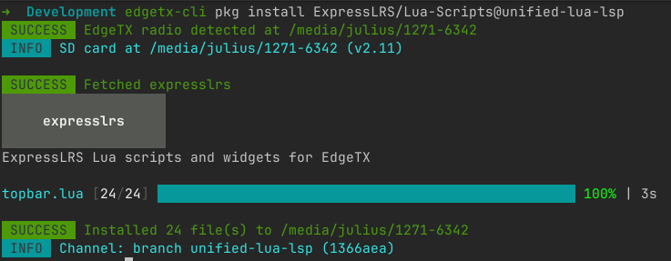

# EdgeTX CLI

A development and management tool for EdgeTX Lua scripts and radios.



## Features

- **Package management** — install, update, remove, and list third-party Lua script packages from Git repositories
- **Live sync** — watch source files and continuously sync changes to an EdgeTX simulator SD card directory
- **Package manifests** — `edgetx.yml` defines your scripts, dependencies, file layout, and exclusions
- **Scaffold scripts** — generate boilerplate for tools, widgets, telemetry, functions, mixes, and libraries
- **Backup** — full SD card backup with optional zip compression and auto-eject
- **Cross-platform** — Linux, macOS, and Windows with platform-specific radio detection

## Installation

With Go installed:

```sh
go install github.com/jurgelenas/edgetx-cli@latest
```

### Build from source

```sh
git clone https://github.com/jurgelenas/edgetx-cli.git
cd edgetx-cli
make build
```

The binary is written to `bin/edgetx-cli`.

## Quick Start

### 1. Initialize a manifest

```sh
edgetx-cli dev init my-scripts
```

This creates an `edgetx.yml` in the current directory.

### 2. Scaffold a script

```sh
edgetx-cli dev scaffold tool MyTool
edgetx-cli dev scaffold widget MyWidget --depends "MyLib"
```

Supported types: `tool`, `widget`, `telemetry`, `function`, `mix`, `library`.

### 3. Sync to the simulator

Point `dev sync` at your EdgeTX simulator's SD card directory. It performs an initial copy then watches for changes:

```sh
edgetx-cli dev sync /path/to/simulator-sdcard
```

Edit your Lua files — changes appear in the simulator immediately.

### 4. Install to a radio

Connect your radio in USB storage mode, then install your local package to it:

```sh
edgetx-cli pkg install . --eject
```

The CLI auto-detects the radio, copies all files, and safely ejects.

### 5. Install a remote package

Install a package directly from a GitHub repository:

```sh
edgetx-cli pkg install ExpressLRS/Lua-Scripts@v1.6.0
```

## Commands

### `dev sync <target-dir>`

Watch source files and sync changes to a target directory.

```sh
edgetx-cli dev sync /path/to/edgetx-sdcard
edgetx-cli dev sync --src-dir ./my-project /path/to/edgetx-sdcard
```

| Flag        | Default | Description                              |
|-------------|---------|------------------------------------------|
| `--src-dir` | `.`     | Source directory containing `edgetx.yml` |

### `pkg install <package>`

Install a package from a Git repository or local directory.

```sh
edgetx-cli pkg install ExpressLRS/Lua-Scripts
edgetx-cli pkg install ExpressLRS/Lua-Scripts@v1.6.0
edgetx-cli pkg install gitea.example.com/user/repo@main
edgetx-cli pkg install .
edgetx-cli pkg install ./my-project --dir /tmp/sdcard
```

| Flag        | Default | Description                                           |
|-------------|---------|-------------------------------------------------------|
| `--dir`     |         | SD card directory (auto-detect if not set)            |
| `--eject`   | `false` | Safely unmount and power off the radio after install  |
| `--dry-run` | `false` | Show what would be installed without writing anything |

**Package references:**

- GitHub shorthand: `Org/Repo`, `Org/Repo@v1.0.0`, `Org/Repo@main`, `Org/Repo@abc123`
- Full URL: `host.com/org/repo`, `https://host.com/org/repo@v1.0`
- Local path: `.`, `./path`, `/absolute/path`

### `pkg update [package]`

Update an installed package to the latest version.

```sh
edgetx-cli pkg update ExpressLRS/Lua-Scripts
edgetx-cli pkg update expresslrs
edgetx-cli pkg update --all
```

| Flag        | Default | Description                                         |
|-------------|---------|-----------------------------------------------------|
| `--dir`     |         | SD card directory (auto-detect if not set)          |
| `--all`     | `false` | Update all installed packages                       |
| `--eject`   | `false` | Safely unmount radio after update                   |
| `--dry-run` | `false` | Show what would be updated without writing anything |

### `pkg remove <package>`

Remove an installed package and all its files.

```sh
edgetx-cli pkg remove ExpressLRS/Lua-Scripts
edgetx-cli pkg remove expresslrs
```

| Flag        | Default | Description                                          |
|-------------|---------|------------------------------------------------------|
| `--dir`     |         | SD card directory (auto-detect if not set)           |
| `--eject`   | `false` | Safely unmount radio after removal                   |
| `--dry-run` | `false` | Show what would be removed without deleting anything |

### `pkg list`

List all installed packages.

```sh
edgetx-cli pkg list
edgetx-cli pkg list --dir /tmp/sdcard
```

| Flag    | Default | Description                                |
|---------|---------|--------------------------------------------|
| `--dir` |         | SD card directory (auto-detect if not set) |

### `dev init [name]`

Initialize a new `edgetx.yml` manifest. Uses the directory name if no name is given.

```sh
edgetx-cli dev init my-scripts
```

| Flag        | Default | Description                         |
|-------------|---------|-------------------------------------|
| `--src-dir` | `.`     | Directory to create `edgetx.yml` in |

### `dev scaffold <type> <name>`

Generate boilerplate for a new EdgeTX Lua script and register it in `edgetx.yml`.

```sh
edgetx-cli dev scaffold tool MyTool
edgetx-cli dev scaffold widget MyWidget --depends "SharedLib"
edgetx-cli dev scaffold library SharedLib
```

| Flag        | Default | Description                              |
|-------------|---------|------------------------------------------|
| `--src-dir` | `.`     | Source directory containing `edgetx.yml` |
| `--depends` |         | Comma-separated library dependencies     |

**Types and output paths:**

| Type        | Path                            | Name limit |
|-------------|---------------------------------|------------|
| `tool`      | `SCRIPTS/TOOLS/<name>/main.lua` | —          |
| `telemetry` | `SCRIPTS/TELEMETRY/<name>.lua`  | 6 chars    |
| `function`  | `SCRIPTS/FUNCTIONS/<name>.lua`  | 6 chars    |
| `mix`       | `SCRIPTS/MIXES/<name>.lua`      | 6 chars    |
| `widget`    | `WIDGETS/<name>/main.lua`       | 8 chars    |
| `library`   | `SCRIPTS/<name>/main.lua`       | —          |

### `backup`

Back up a connected radio's SD card.

```sh
edgetx-cli backup
edgetx-cli backup --compress --eject
edgetx-cli backup --directory ~/backups --name my-radio
```

| Flag          | Default | Description                                         |
|---------------|---------|-----------------------------------------------------|
| `--compress`  | `false` | Create a `.zip` archive instead of a directory      |
| `--directory` | `.`     | Output directory for the backup                     |
| `--name`      |         | Custom backup name prefix (date is always appended) |
| `--eject`     | `false` | Safely unmount radio after backup                   |

Backups are named `backup-YYYY-MM-DD` (or `<name>-YYYY-MM-DD` with `--name`).

### Global flags

| Flag              | Default | Description                          |
|-------------------|---------|--------------------------------------|
| `-v`, `--verbose` | `false` | Enable debug logging                 |
| `--log-format`    | `text`  | Log output format (`text` or `json`) |

## Manifest format

The `edgetx.yml` file describes your package and its contents:

```yaml
package:
  name: expresslrs
  description: ExpressLRS Lua scripts and widgets for EdgeTX
  license: GPL-3.0        # optional: SPDX license identifier
  source_dir: src          # optional: subdirectory containing source files
  # binary: true           # optional: set to true for packages distributing .luac bytecode

libraries:
  - name: ELRS
    path: SCRIPTS/ELRS

tools:
  - name: ExpressLRS
    path: SCRIPTS/TOOLS/ExpressLRS
    depends:
      - ELRS

widgets:
  - name: ELRSTelemetry
    path: WIDGETS/ELRSTelemetry
    depends:
      - ELRS
    exclude:
      - "*.luac"

telemetry:
  - name: MyTelem
    path: SCRIPTS/TELEMETRY/MyTelem

functions:
  - name: MyFunc
    path: SCRIPTS/FUNCTIONS/MyFunc

mixes:
  - name: MyMix
    path: SCRIPTS/MIXES/MyMix
```

- `depends` references entries in `libraries`
- `exclude` takes glob patterns to skip during copy (e.g., `["*.luac", "presets.txt"]`)
- `source_dir` is relative to the manifest file; all `path` values are relative to the source root
- `binary: true` disables the default `*.luac` exclusion, allowing compiled bytecode to be installed

## State file

Installed packages are tracked in `RADIO/packages.yml` on the SD card:

```yaml
packages:
  - source: ExpressLRS/Lua-Scripts
    name: expresslrs
    channel: tag
    version: v1.6.0
    commit: abc123def456789...
    paths:
      - SCRIPTS/TOOLS/ELRS
      - SCRIPTS/ELRS

  - source: "local::/home/user/my-project"
    name: my-tool
    channel: local
    paths:
      - SCRIPTS/TOOLS/MyTool
```

Channels: `tag` (semver release), `branch` (branch HEAD), `commit` (pinned SHA), `local` (local directory).

## Platform support

Radio detection works by scanning mounted volumes for the `edgetx.sdcard.version` marker file:

- **Linux** — scans `/media/<user>`, ejects via `udisksctl`
- **macOS** — scans `/Volumes`
- **Windows** — scans drive letters

## License

[GPL-3.0](LICENSE)
